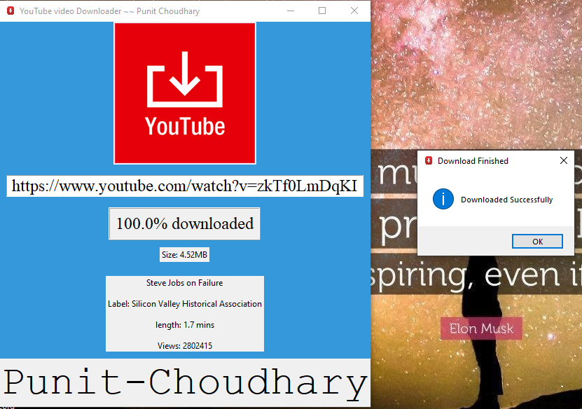

# YT_video_downloader_with_GUI
## Python GUI Program to download Youtube videos.

### Installation Guide
* `pip install pytube` -- [pytube](https://pypi.org/project/pytube/) is a very serious, lightweight, dependency-free Python library (and command-line utility) for downloading YouTube Videos.
* `git clone https://github.com/Punit-Choudhary/YT_video_downloader_with_GUI.git` -- clone repo at your end.
* `python main.py` -- Run `main.py` to run program, or directly run by clicking on file.

### ScreenShot

